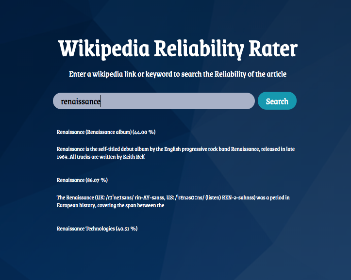
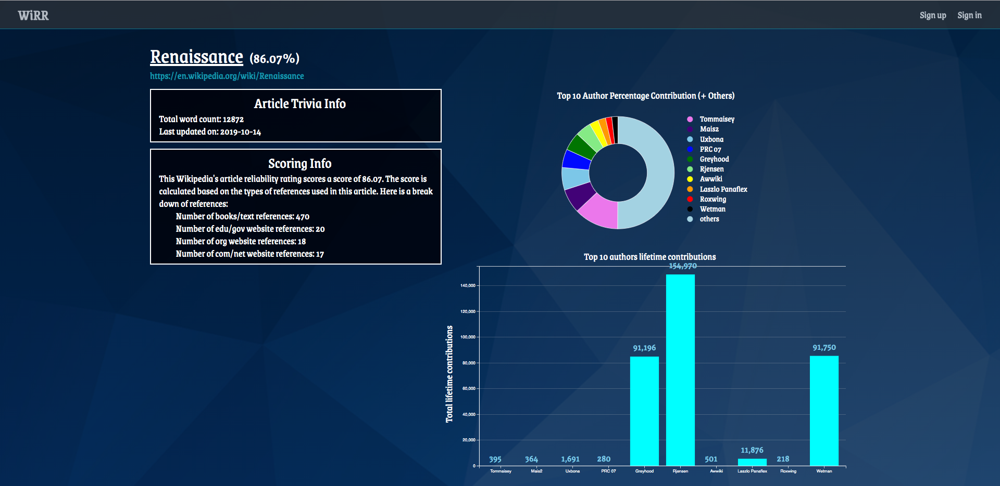

# Wikipedia Reliability Rater (WiRR)
<!-- <a href="https://www.mongodb.com/"></a>
<a href="#"></a>
<a href="#"></a>
<a href="https://github.com"></a> -->

[WiRR Live](http://www.wikipediarr.com/)

## Background and Overview
WiRR is an application to help determine the reliability of a given Wikipedia's article. The reliability of the article is determined by our custom made reliability index. The reliability index is determined mainly by citations. The citations have the following scoring:
  | Domain / Source        | Score         |
  |:-----------------------|:--------------|
  | text/scholarly article | 5             |
  | `.edu` / `.gov`        | 4             |
  | `.org`                 | 3             |
  | `.com` / `.net`        | 1             |

This would then be divided by the maximum total score and multiplied by 100 to get a percentage.

## Technologies
#### Stack
- Backend
  - Node
  - Express
  - MongoDB
- Frontend
  - React
  - Redux
#### Noticable Dependencies
- bcrypjs
  - Use: Hash passwords before they get stored in database
- uuid
  - Use: 
- cheerio
  - Use: Scrape inforamtion from certain web pages
- Request
  - Use: Go to a certain webpage
- D3
  - Use: Display data from charts
#### APIs
- [Wikimdeia API](https://www.mediawiki.org/wiki/API:Main_page)
  - Uses: 
    - Search functionality
    - Get total lifetime contributions of certain authors

## Setup
1. Create file called `key_dev.js` under `./config` directory
   - And place code snippet with following format into your file:
   ```javaScript
    module.exports = {
      "mongoURI": "YOUR MONGO URI KEY HERE",
      "secretOrKey": "YOUR SECRET OR KEY HERE"
    }
   ```
2. `npm install` in root directory to install root dependencies
3. `npm install` in `./client` to install frontend dependencies
4. `npm run dev` to run both server and webpack
5. Open http://localhost:3000/

## How to use
1. Go to [WiRR](http://www.wikipediarr.com/)


2. Search for the article you are interested in



3. Analyze result and measure how reliable this article is


  - Things to look at:
    - Last updated date
      - Is it new? Is it old?
    - Citation source distribution
      - Articles that have a majority of text citations are considered reliable in our measures
    - Author activity
      - Is this article mainly written by one author (observe donut chart)? If so, how many lifetime contributions do they have (observe bar chart)?
      
## Noticeable Features
#### Interactive User Auth Errors

#### Dynamic Search

#### D3 Graphs


## Future Features
  - Ability for user to save favorite articles
  - Integration of author lifetime contributions into reliability score
    - If author with high number of lifetime contributions has written a significant portion of article, then article becomes more reliable.